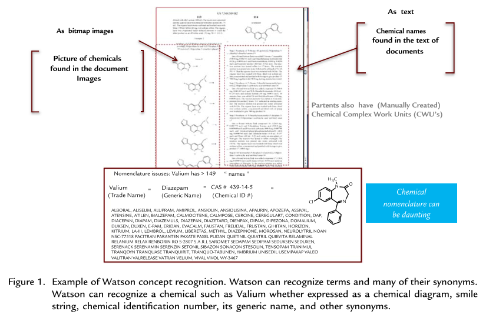
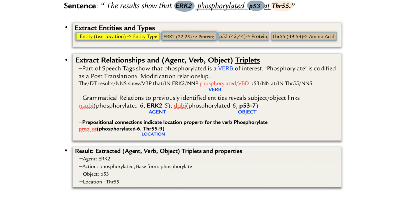

```{r setup, include=FALSE}
knitr::opts_chunk$set(echo = FALSE)
```

## Contexto

* IBM Watson venceu Jeopardy em 2011

{width=40%}


* Usando Processamento de Linguagem Natural PROFUNDA (com contexto) e acesso a conteúdo da Internet [@high2012era]

* A IBM resolveu investir na medicina por IA em 2014

## Problema


* A escolha de tratamento de câncer é complexa [@Puglielli2018]:
  - Efetividade depende das características do paciente e da doença
  - É muito difícil saber se a escolha foi correta
  - A literatura é muito vasta

* Quanto à literatura [@Chen2016]:
  - 200.000 experimentos com 21.000 novos medicamentos ativos
  - Existem 24 milhões de artigos de medicina publicados. 1,8 milhão é publicado anualmente
  - O número de novos artigos científicos publicados dobra a cada 9 anos


## Teoria

Usando Processamento de Linguagem Natural Profunda e até mesmo reconhecimento diagramas químicos, é possível chegar a possíveis tratamentos, que podem ser ranqueados quanto à sua efetividade para um paciente específico [@Chen2016], de forma mais eficiente do que uma junta médica.


{width=60%}

{width=60%}


## Experimento

* IBM Watson está em experiência em vários lugares, mas em nenhum ele está "em produção" ainda.

* Os artigos avaliam a taxa de concordância entre o IBM Watson e uma junta médica

  - A maioria dos artigos aponta uma taxa de concordância alta, chegando a 93% [@10.1093/annonc/mdx781] [@10.1093/annonc/mdy297.031]

  - Alguns artigos mostram taxas variáveis por tipo de câncer, e concluem que Watson ainda não está maduro para substituir médicos humanos [@lee2018assessing] [@zhou2019concordance]
  

* Todos os artigos jornalísticos encontrados fazem críticas ao IBM Watson, relatando que em nenhum caso ele está em produção e que em alguns casos ele gerou decisões de tratamento injustificáveis e claramente erradas.
  - O mais completo deles [@strickland2019ibm] mostra uma lista de lugares onde o Watson foi testado. Em alguns ele foi descontinuado e em outros continua em testes, mas em apenas em um ele é usado de verdade.
  - Em alguns lugares houve resultados melhores com o Watson for Genomics, que usa informação estruturada (genoma) ao invés dos prontuários. Há dificuldade em se entender os dados dos prontuários dos pacientes.


## Discussões

* Ambiente Kind x Wicked
  - Gary Klein sempre estudou como a intuição de especialistas melhora com o tempo
  - Daniel Kahneman sempre executou experimentos onde as intuições se mostravam falhas (mesmo para especialistas)
  - Em um artigo em conjunto [@kahneman2009conditions], eles concluem que não há discordância: o tipo de ambiente onde se dá a decisão que faz o uso da intuição ser mais difícil. As definições de ambientes Kind e Wicked vêm de um livro de Hogarth [@hogarth2001educating].

* Questões comerciais. Trade-off lançar logo x lançar maduro.
  - A IBM saiu ganhando?
  - Entrar numa empreitada dessas é arriscado. Como financiar? Governo?

* Tolerância para erros de IA menor que erros humanos?
  - Por que aceitamos tantas mortes por motoristas humanos mas nos escandalizamos com uma morte por um carro autônomo?
  - Quem deveria assumir a responsabilidade?
  - O racional por trás das decisões por IA é menos transparente. Como melhorar isso?


## Referências


