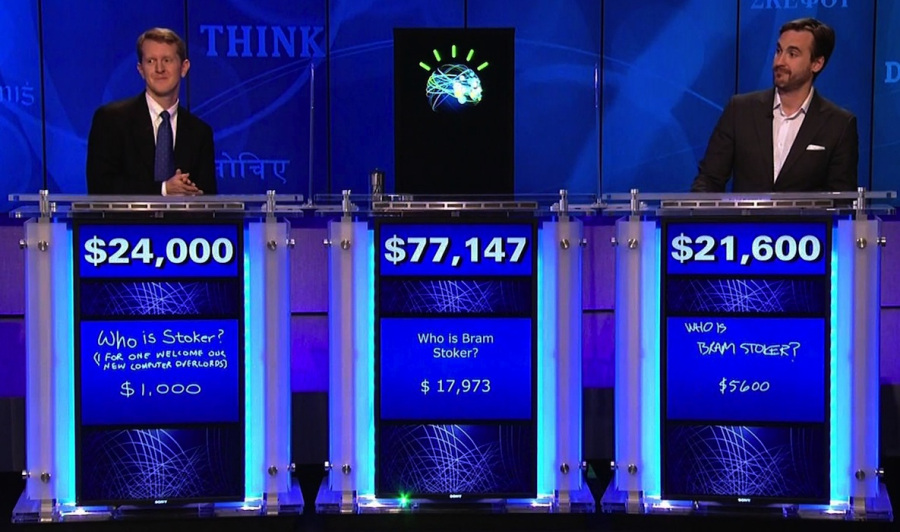

```{r setup, include=FALSE}
knitr::opts_chunk$set(echo = FALSE)
```

## Pretensão da IBM

* Após IBM Watson venceu Jeopardy




* A IBM resolveu investir na medicina por IA em 2014


## Projetos de IA na Medicina com o Watson

* Principal projeto: ajudar na escoklha do tratamento (Watson for Oncology)

* Dados

  + Prontuário do Paciente

  + Literatura Médica

* Metodologia

  + Aprendizado estatístico

  + Natural Language Processing

## Resultados

* Resultados por enquanto

  * Em alguns lugares, foi descontinuado

  * Em alguns lugares, é usado para testes

  * Em alguns lugares, foi acusado de tomar decisões erradas

* Dificuldade de interpretar textos

* Melhores resultados usando como base o DNA do paciente (Watson for Genomics)

* O status atuais dos testes estão [aqui](https://spectrum.ieee.org/biomedical/diagnostics/how-ibm-watson-overpromised-and-underdelivered-on-ai-health-care) 


## Discussões

* Trade-off lançar logo x lançar maduro

* Tolerância para erros de IA menor que erros humanos?

* Ambiente Kind x Wicked

* Expectativa criada pelo marketing  


## Artigos visitados

https://www.computerworld.com/article/3321138/did-ibm-put-too-much-stock-in-watson-health-too-soon.html  

https://spectrum.ieee.org/biomedical/diagnostics/how-ibm-watson-overpromised-and-underdelivered-on-ai-health-care 

https://becominghuman.ai/the-shaming-of-watson-3d0672d59f1 

https://www.bloomberg.com/opinion/articles/2018-08-24/ibm-s-watson-failed-against-cancer-but-a-i-still-has-promise 

https://www.economist.com/business/2017/10/21/ibm-lags-in-cloud-computing-and-ai-can-techs-great-survivor-recover 

https://www.economist.com/babbage/2013/02/14/doctor-watson
  


